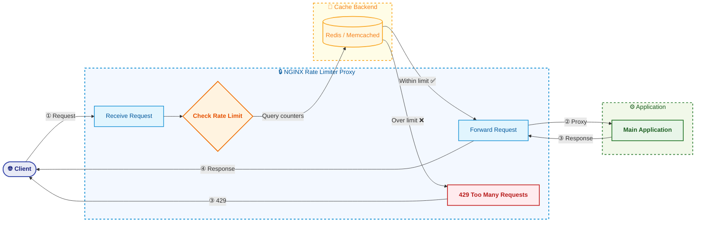
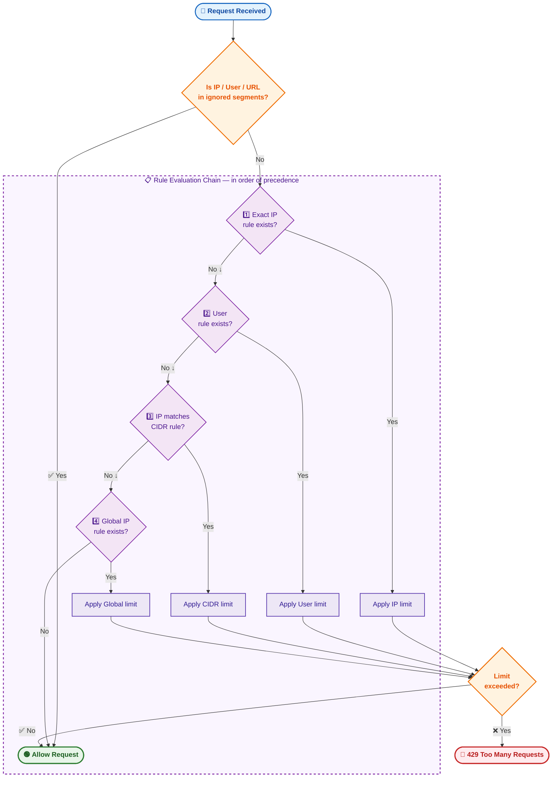

<div align="center">

# 🛡️ NGINX Rate Limiter Proxy

**A distributed, lightweight reverse proxy for traffic regulation and rate limiting — built with OpenResty, Lua, and Redis.**


[](https://codecov.io/github/omarfawzi/Nginx-Ratelimiter-Proxy)

---

Intercepts incoming traffic and enforces rate limits **before requests reach your backend**.  
Designed as a **Kubernetes sidecar**, powered by **NGINX + Lua**, backed by **Redis** or **Memcached**.

</div>

---

## 📖 Table of Contents

- [Key Features](#-key-features)
- [Architecture](#-architecture)
- [Interaction Flow](#-interaction-flow)
- [Configuration](#-configuration)
  - [Rate Limit Rules](#rate-limit-rules)
  - [Environment Variables](#environment-variables)
- [Running the Proxy](#-running-the-proxy)
- [Why Redis Over Memcached?](#-why-redis-over-memcached)
- [Extending with Snippets](#-extending-nginx-configuration-with-snippets)
- [Prometheus Metrics](#-prometheus-metrics)
- [Request Flow](#-request-flow)

---

## ✨ Key Features

| Feature | Description |
|---|---|
| **Kubernetes Sidecar** | Manages traffic before it enters your main application container |
| **NGINX + Lua** | Leverages `lua-resty-global-throttle` and `lua-resty-redis` for high-performance rate limiting |
| **Flexible Caching** | Supports both **Redis** and **Memcached** as distributed cache backends |
| **Multiple Algorithms** | Fixed window, sliding window, leaky bucket, and token bucket |
| **Configurable Rules** | YAML-driven configuration with per-user, per-IP, CIDR, and global rules |
| **Prometheus Metrics** | Built-in observability with request count, latency, and connection gauges |

---

## 🏗 Architecture



---

## 🔄 Interaction Flow

| Step | Description |
|---:|---|
| **1** | **Client** sends a request to the application |
| **2** | **NGINX Proxy** intercepts the request |
| **3** | **Rate Limiter** checks the request against rules defined in `ratelimits.yaml` |
| **4** | **Decision** is made — see details below |
| **5** | **Main Application** processes the request if it passes |
| **6** | **Response** travels back through the proxy to the client |

### Decision Logic (Step 4)

- **Ignored Segments** — If the IP, user, or URL matches `ignoredSegments`, rate limiting is bypassed entirely.
- **Rate Limit Exceeded** — Returns `429 Too Many Requests` immediately.
- **Within Limits** — Request is proxied to the main application.
- **Lua Exception** — On error, the request is still forwarded (fail-open). Monitor this carefully.

> **Rule Precedence:** Explicit IP addresses take priority over users, which take priority over CIDR ranges (e.g., `0.0.0.0/0`).

---

## ⚙ Configuration

### Rate Limit Rules

Rules are defined in `ratelimits.yaml` and mounted into the container:

```yaml
ignoredSegments:
  users:
    - admin
  ips:
    - 127.0.0.1
  urls:
    - /v1/ping

rules:
  /v1:
    users:
      user2:
        limit: 50
        window: 60
    ips:
      192.168.1.1:
        limit: 200
        window: 60
  ^/v2/[0-9]$:
    users:
      user3:
        flowRate: 10
        limit: 30
        window: 60
```

| Field | Description |
|---|---|
| `ignoredSegments` | Users, IPs, and URLs that bypass rate limiting entirely |
| `rules.<path>` | URI path to match. Use `/` for global. Supports [Lua regex](https://github.com/openresty/lua-nginx-module?tab=readme-ov-file#ngxrematch) |
| `limit` | Maximum requests allowed within the time window |
| `window` | Time window in seconds |
| `flowRate` | Request rate in RPS for `leaky-bucket` (leak rate) and `token-bucket` (refill rate). Defaults to `limit/window` |

> [!NOTE]
> Mount your `ratelimits.yaml` to: `/usr/local/openresty/nginx/lua/ratelimits.yaml`

> [!NOTE]
> When `0.0.0.0/0` is specified in rules, rate limiting is applied **per IP**, not globally.  
> Example: a limit of 10 RPS means `127.0.0.1` and `127.0.0.2` each get 10 RPS independently.

---

### Environment Variables

| Variable | Description | Required | Default |
|---|---|:---:|---|
| `UPSTREAM_HOST` | Hostname of the main application | ✅ | — |
| `UPSTREAM_PORT` | Port of the main application | ✅ | — |
| `UPSTREAM_TYPE` | Upstream type: `http`, `fastcgi`, or `grpc` | ✅ | `http` |
| `CACHE_HOST` | Hostname of the distributed cache | ✅ | — |
| `CACHE_PORT` | Port of the distributed cache | ✅ | — |
| `CACHE_PROVIDER` | Cache backend: `redis` or `memcached` | ✅ | — |
| `CACHE_PREFIX` | Unique prefix per server group/namespace | ✅ | — |
| `REMOTE_IP_KEY` | Source IP variable: `remote_addr`, `http_cf_connecting_ip`, or `http_x_forwarded_for` | ✅ | — |
| `CACHE_ALGO` | Algorithm: `fixed-window`, `sliding-window`, `leaky-bucket`, `token-bucket` (Redis only) | ❌ | `sliding-window` |
| `INDEX_FILE` | Default index file for FastCGI | ❌ | `index.php` |
| `SCRIPT_FILENAME` | Script filename for FastCGI | ❌ | `/var/www/app/public/index.php` |
| `PROMETHEUS_METRICS_ENABLED` | Enable Prometheus metrics on `:9145/metrics` | ❌ | `false` |
| `LOGGING_ENABLED` | Enable NGINX logs | ❌ | `true` |

---

## 🚀 Running the Proxy

```sh
docker run --rm --platform linux/amd64 \
  -v $(pwd)/ratelimits.yaml:/usr/local/openresty/nginx/lua/ratelimits.yaml \
  -e UPSTREAM_HOST=localhost \
  -e UPSTREAM_TYPE=http \
  -e UPSTREAM_PORT=3000 \
  -e CACHE_HOST=mcrouter \
  -e CACHE_PORT=5000 \
  -e CACHE_PROVIDER=memcached \
  -e CACHE_PREFIX=local \
  -e REMOTE_IP_KEY=remote_addr \
  ghcr.io/omarfawzi/nginx-ratelimiter-proxy:master
```

#### Custom Resolver

Mount your own resolver config:

```sh
-v $(pwd)/resolver.conf:/usr/local/openresty/nginx/conf/resolver.conf
```

---

## 🔴 Why Redis Over Memcached?

| Capability | Redis | Memcached |
|---|:---:|:---:|
| Atomic operations with expiry | ✅ | ❌ |
| Multiple rate-limiting algorithms | ✅ | ❌ |
| Lua scripting (`EVAL`) | ✅ | ❌ |
| Race-condition-free counters | ✅ | ❌ |

> [!WARNING]
> **Avoid Redis replicas for rate limiting.** Redis replication is asynchronous — lag between master and replica can cause stale reads that allow requests to bypass limits. Always read and write against the **master instance**.

---

## 🛠 Extending Nginx Configuration with Snippets

Customize the NGINX configuration by mounting snippet files into the container:

| Snippet | Context | Mount Path |
|---|---|---|
| `http_snippet.conf` | `http` block | `/usr/local/openresty/nginx/conf/http_snippet.conf` |
| `server_snippet.conf` | `server` block | `/usr/local/openresty/nginx/conf/server_snippet.conf` |
| `location_snippet.conf` | `location` block | `/usr/local/openresty/nginx/conf/location_snippet.conf` |
| `resolver.conf` | DNS resolvers | `/usr/local/openresty/nginx/conf/resolver.conf` |

```sh
docker run -d \
  -v $(pwd)/snippets/http_snippet.conf:/usr/local/openresty/nginx/conf/http_snippet.conf \
  -v $(pwd)/snippets/server_snippet.conf:/usr/local/openresty/nginx/conf/server_snippet.conf \
  -v $(pwd)/snippets/location_snippet.conf:/usr/local/openresty/nginx/conf/location_snippet.conf \
  ghcr.io/omarfawzi/nginx-ratelimiter-proxy:master
```

---

## 📊 Prometheus Metrics

> **Prerequisite:** Set `PROMETHEUS_METRICS_ENABLED=true`

Metrics are exposed on port `9145`:

```sh
curl http://<server-ip>:9145/metrics
```

| Metric | Type | Description |
|---|---|---|
| `nginx_proxy_http_requests_total` | Counter | Total HTTP requests by host and status |
| `nginx_proxy_http_request_duration_seconds` | Histogram | Request latency distribution |
| `nginx_proxy_http_connections` | Gauge | Active connections (reading, writing, waiting) |

---

## 🔀 Request Flow



---

<div align="center">

**MIT License** · Built with [OpenResty](https://openresty.org/) and [lua-resty-global-throttle](https://github.com/ElvinEfendi/lua-resty-global-throttle)

</div>
